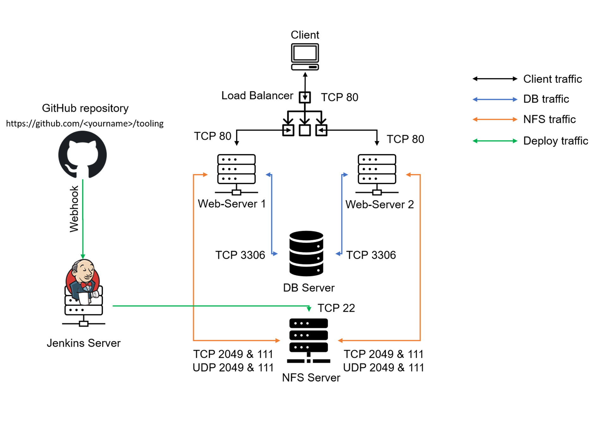

# Continous Integration- ipeline For Tooling Website with Jekins

In this project, I implement a Jekins CI - which update changes from a GitHub repo to a host Tooling Website.
The diagram below explains the overall project implementation.

