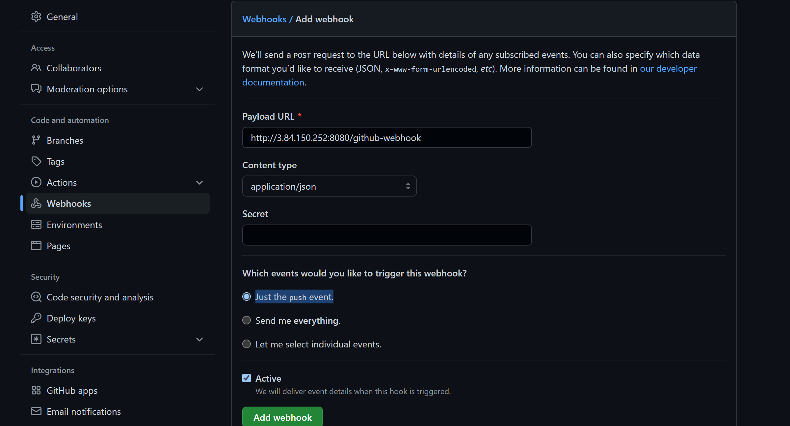
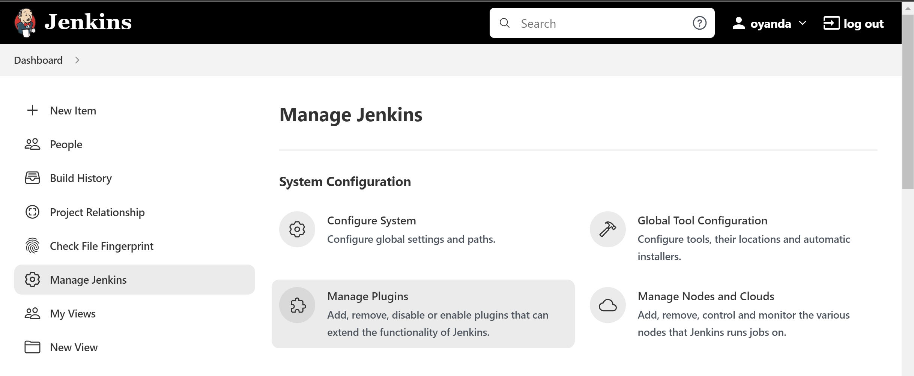
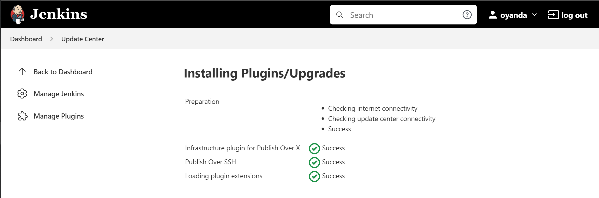
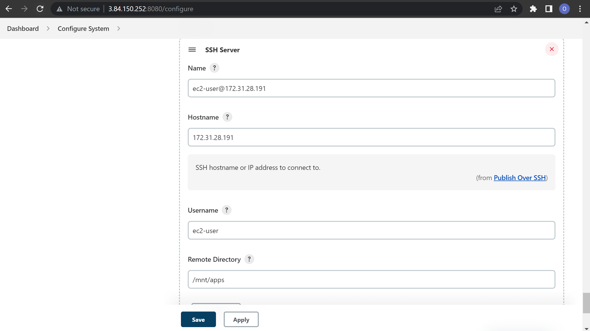
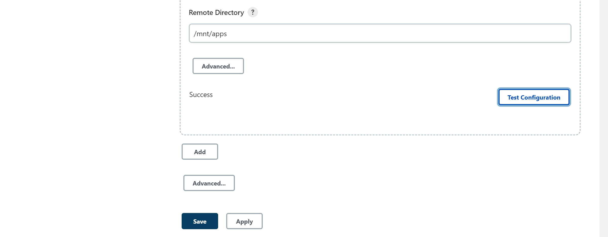
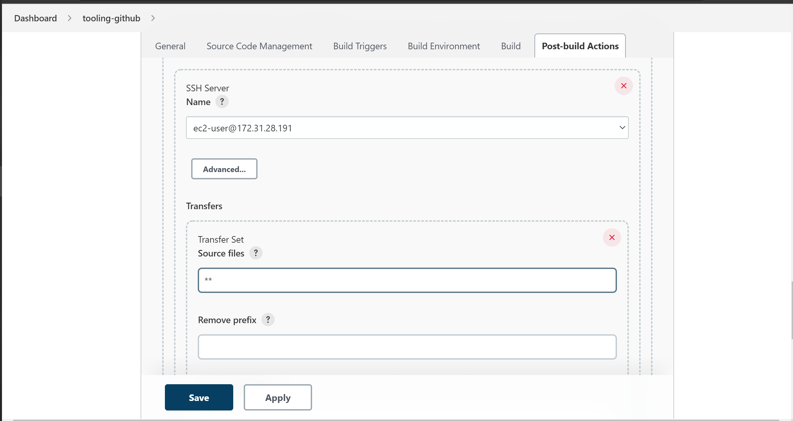
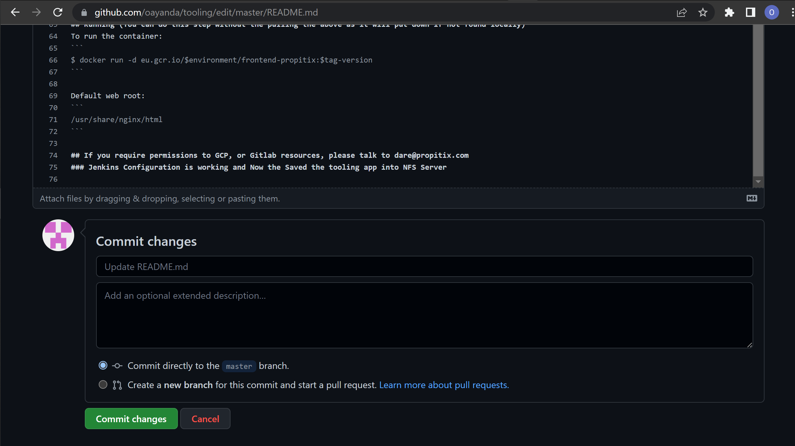
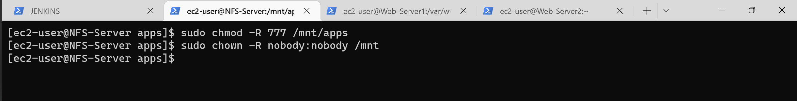
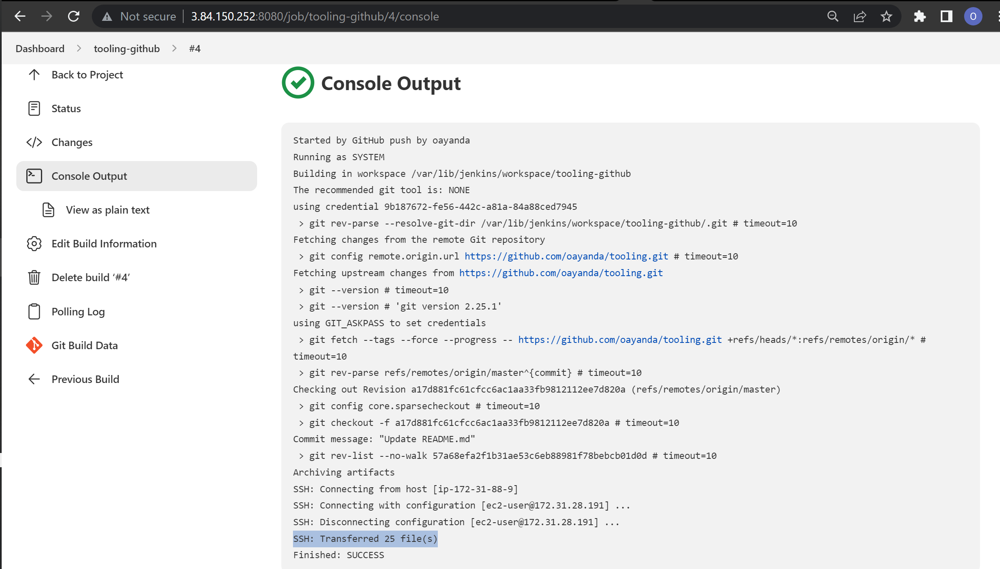
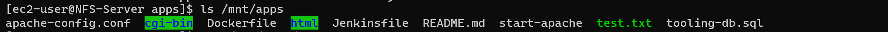

# INSTALL AND CONFIGURE JENKINS SERVER

Lunch an AWS EC2 instance server based on Ubuntu Server 20.04 LTS and name it Jenkins.


Login into the terminal and install JDK

```bash
sudo apt update -y && sudo apt install default-jdk-headless -y
```


Install Jenkins

```bash
wget -q -O - https://pkg.jenkins.io/debian-stable/jenkins.io.key | sudo apt-key add -
sudo sh -c 'echo deb https://pkg.jenkins.io/debian-stable binary/ > \
    /etc/apt/sources.list.d/jenkins.list'
sudo apt update
sudo apt-get install jenkins
```


Verify Jenkins up and running

```bash
systemctl status jenkins
```


By default Jenkins server uses TCP port 8080 – Let's open it by creating a new Inbound Rule in your EC2 Security Group


Let's setup Jenkins - from the broswer, use the jenkins instance public Ip:8080


To get the administrator's password

```bash
sudo cat /var/lib/jenkins/secrets/initialAdminPassword
```


Enter the password and click on continue


Click on the ```install suggested plugins``` , once installation is completed, you would be required to create an admin account aand you will get your Jenkins server address.


Jenkins setp is complete


## Configure Jenkins to retrieve source codes from GitHub using Webhooks to be stored locally in Jenkins.

Time to enable Webhook in my GitHub repo.
Use the following steps: 
Go to the repo you want to store in Jenkins - my case the tooling repo. Click
```settings > Webhooks > Add webhook```
> In the ```Payload URL field```, insert the jenkins url (public ip) and the github-webhook path like this
```http://3.84.150.252:8080/github-webhook```

> In the Content type field, select ```application/json```

> For - Which events would you like to trigger this webhook? Make sure, ```Just the push event``` is selected and click Add webhook. See details below.



Next, Go to Jenkins web console, click "New Item" and create a ```Freestyle project```
Give the job/project a name ```tooling-github``` and click ok.


To connect my GitHub repository, I need to provide its URL, this was copy it from the repository itself


In the Source Code Management tab of the Jenkins freestyle project choose Git repository, provide there the link to the Tooling GitHub repository and credentials (user/password) so Jenkins could access files in the repository.

Now, under Credentials, select the newly created github login details and click save.

For now I will run the build manually.
Click on ```Build Now```

The green mark ```#1``` show the build was successful.

The above build was ran manually, now I will configure the job to use the earlier setup webhook.

In the project dashboard, Click "Configure" your job/project and add these two configurations

Click on ```Build Triggers``` and select ```GitHub hook trigger for GITScm polling``` to Configure triggering the job from GitHub webhook

Configure "Post-build Actions" to archive all the files – files resulted from a build are called "artifacts". Click on ```Add post-build action``` and select ```Archive the artifacts```. In the  ```Files to archive?```  input  ```**``` to archive mulitiple nested artifacts and click on save.


Now let's verify the configuration, I will edit the README.md to make some changes.

You can build ```#2```was done automatically with the webhook setup

for more details, click build ```#2``` and check the console output


By default, the artifacts are stored on Jenkins server locally

```bash
ls /var/lib/jenkins/jobs/tooling-github/builds/2/archive/
```


## CONFIGURE JENKINS TO COPY FILES TO NFS SERVER VIA SSH

Currently, the artifacts is stored in Jenkins but in order to implement a Jenkins CI it needs to be in the NFS Server to serve data to the Web Servers - by so doing, any changes made in the version control system (GitHub) would automatically update the Web Servers.

The next step is to copy them to the NFS server ```/mnt/apps``` directory.

To do this securely in Jenkins, I would install a plugin called ```Publish Over SSH```

On the main dashboard click ```Manage Jenkins``` and select ```Manage Plugins```



Click on Available and search for ```Publish Over SSH``` select and install without restart


Now, let's Configure the job/project to copy artifacts over to NFS server.

On main dashboard select ```Manage Jenkins``` and choose ```Configure System``` menu item.

Scroll down to Publish over SSH plugin configuration section and configure it to be able to connect to your NFS server

1.  Provide a private key (content of .pem file that you use to connect to NFS server via SSH).

*Add the Passphrase if the private key is configured with one.*

2. Click on ```SSH Servers``` to expand and file the required details, Test configuration and save.

> Hostname – can be private IP address of your NFS server

> Username – ec2-user (since NFS server is based on EC2 with RHEL 8)

> Remote directory – /mnt/apps since our Web Servers use it as a mointing point to retrieve files from the NFS server.





open Jenkins job/project configuration page and add another one ```Post-build Action```

Click on ```Add post-build action``` and select ```Send build artifacts over SSH```
Configure it to send all ```( denoted by ** )``` files probuced by the build into our previouslys define remote directory.

Save this configuration 


Now, lets verify - change something in README.MD file in the GitHub Tooling repository.


Login into the NFS Server instance and change the permission to allow Jenkins to save files in the /mnt directory.


Verify a successful and automically build in Jenkins



Verify the files was succesfully updated in ```/mnt/apps``` 


Check the changes in README.md file


✨✔️ ✔️